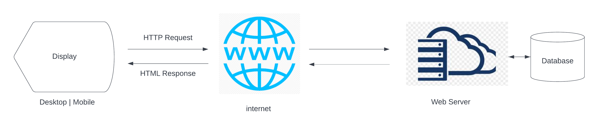
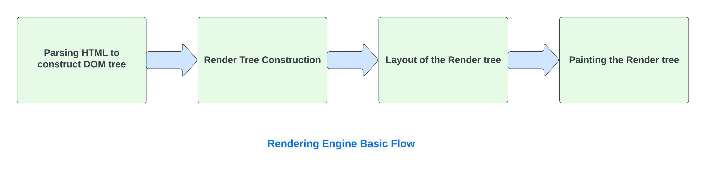
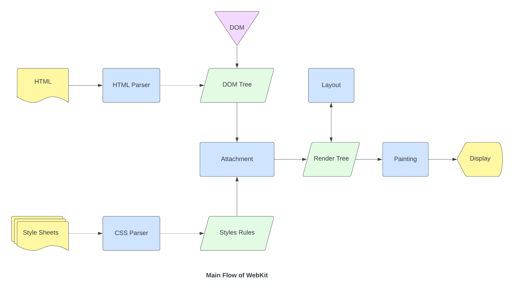
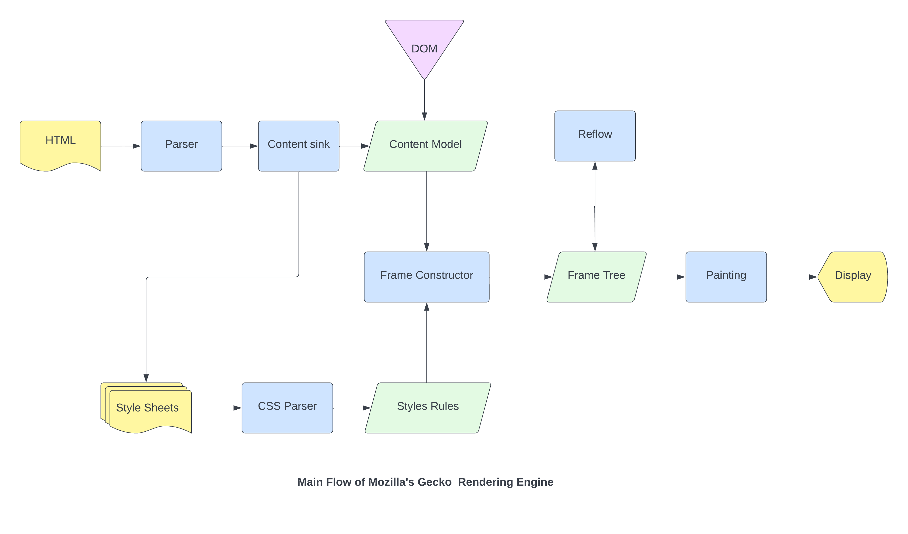
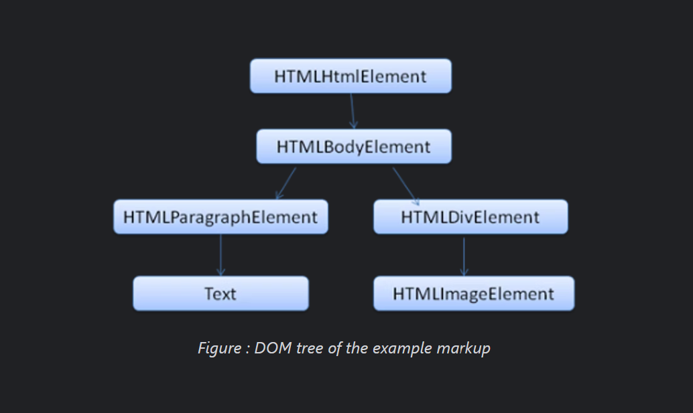
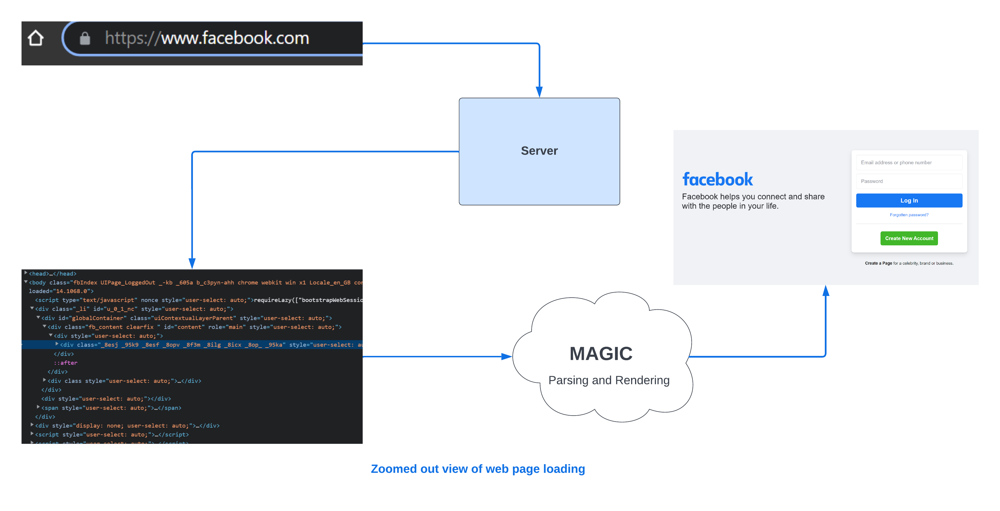
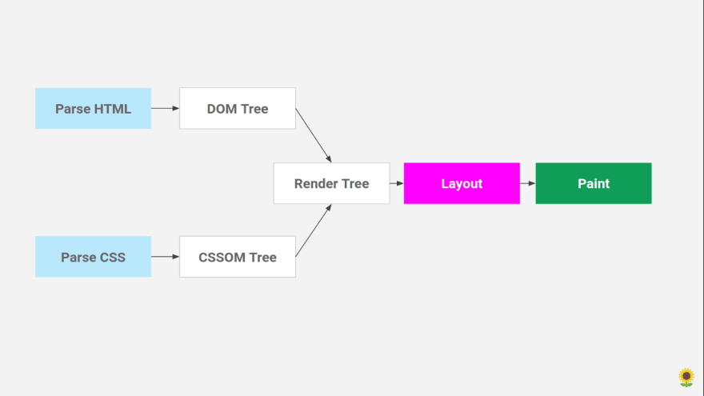
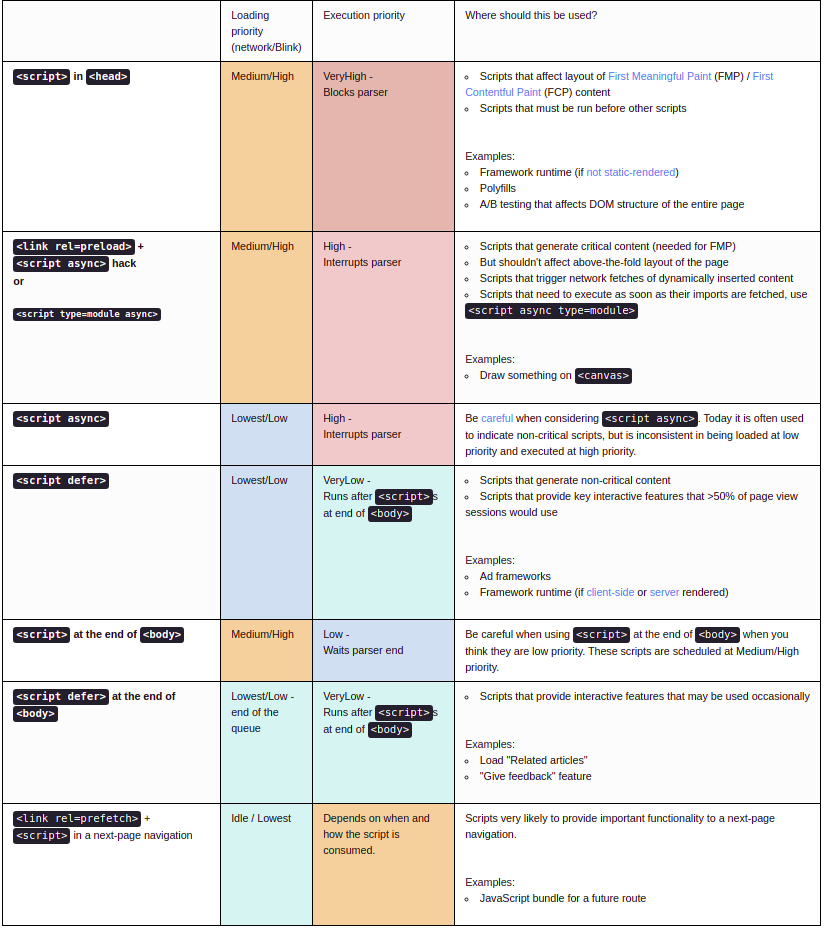

## Pesto-p4 | WEEK1-HTML | Exercise 1.1 | Swapnil Akolkar

> ## Question

When a user enters an URL in the browser, how does the browser fetch the desired result ? Explain this with the below in mind and Demonstrate this by drawing a diagramfor the same.
1. What is the main functionality of the browser?
2. High Level Components of a browser
3. Rendering engine and its use
4. Parsers (HTML, CSS, etc)
5. Tree construction
6. Layout and Painting
7. Script Processors
8. Order of script processing

> ## Answer

The **Internet** is a global network of networks while the Web, also referred formally as **World Wide Web (www)** is a collection of information that is accessed via the Internet.Web is vast and powerfull tool. Just within few decades
the internet has changed the way we work, the way we interact as individuals and as society. It has played huge role in our advancement towards a borderless world - bringing us closer than ever before. Depending on how it is used it bridges nations, drives commerce, nurtures relationships, gives a voioce to the unheard and drives the innovation engine of the future.

In short period of time since the evolutiion of internet and web, we have gone from being amazed by the ability to send an email to someone around the world, to a change in how we think about information. And Web Browsers have played significant role in democratisation of internet, but do we unnderstand what 'web browsers' are? and ahow do they work?

### **What is browser?**

A web browser takes you anywhere on the internet. It retrieves information from other parts of the web and displays it on your desktop or mobile device. The information is transferred using the **Hypertext Transfer Protocol**, which defines how text, images and video are transmitted on the web.

### **1. what is the main funcionality of browser?** 



Retrieving informative resources from web on demand, translating received resource and dislaying its content to the user, allowing user to interact with web pages and other dynamic content via hyperlinks - navigation facility (ie. to go to different locations by clicking on links) which makes surfing easy and fun.

### **2. High level components of a browser:**


>**Browser's main components:**

1. **The user interface:**
This includes the address bar, back/forward button, bookmarking menu, etc. Every part of the browser display except the window where you see the requested page.

2. **The browser engine:**
marshals actions between the UI and the rendering engine.

3. **The rendering engine :**
responsible for displaying requested content. For example if the requested content is HTML, the rendering engine parses HTML and CSS, and displays the parsed content on the screen.

4. **Networking:**
For network calls such as HTTP requests, using different implementations for different platform behind a platform-independent interface.

5. **UI backend:**
Used for drawing basic widgets like combo boxes and windows. This backend exposes a generic interface that is not platform specific. Underneath it uses operating system user interface methods.

6. **JavaScript interpreter:**
Used to parse and execute JavaScript code.

7. **Data storage:**
This is a persistence layer. The browser may need to save all sorts of data locally, such as cookies. Browsers also support storage mechanisms such as localStorage, IndexedDB, WebSQL and FileSystem.

It is important to note that browsers such as Chrome run multiple instances of the rendering engine: one for each tab. Each tab runs in a separate process.

### **3. Rendering engine and its use:**
The responsibility of the rendering engine is well… Rendering, that is display of the requested contents on the browser screen.

By default the rendering engine can display HTML and XML documents and images. It can display other types of data via plug-ins or extension; for example, displaying PDF documents using a PDF viewer plug-in.

#### *Rendering engines:*
Different browsers use different rendering engines: Internet Explorer uses Trident, Firefox uses Gecko, Safari uses WebKit. Chrome and Opera (from version 15) use Blink, a fork of WebKit.

WebKit is an open source rendering engine which started as an engine for the Linux platform and was modified by Apple to support Mac and Windows. See webkit.org for more details.

#### *The main flow:*
The rendering engine will start getting the contents of the requested document from the networking layer. This will usually be done in 8kB chunks.

After that, this is the basic flow of the rendering engine:



The rendering engine will start parsing the HTML document and convert elements to DOM nodes in a tree called the "content tree". The engine will parse the style data, both in external CSS files and in style elements. Styling information together with visual instructions in the HTML will be used to create another tree: the render tree.

The render tree contains rectangles with visual attributes like color and dimensions. The rectangles are in the right order to be displayed on the screen.

After the construction of the render tree it goes through a "layout" process. This means giving each node the exact coordinates where it should appear on the screen. The next stage is painting - the render tree will be traversed and each node will be painted using the UI backend layer.

It's important to understand that this is a gradual process. For better user experience, the rendering engine will try to display contents on the screen as soon as possible. It will not wait until all HTML is parsed before starting to build and layout the render tree. Parts of the content will be parsed and displayed, while the process continues with the rest of the contents that keeps coming from the network.
### *Main Flow Examples:*




From figures we can see that although WebKit and Gecko use slightly different terminology, the flow is basically the same.

Gecko calls the tree of visually formatted elements a "Frame tree". Each element is a frame. WebKit uses the term "Render Tree" and it consists of "Render Objects". WebKit uses the term "layout" for the placing of elements, while Gecko calls it "Reflow". "Attachment" is WebKit's term for connecting DOM nodes and visual information to create the render tree. A minor non-semantic difference is that Gecko has an extra layer between the HTML and the DOM tree. It is called the "content sink" and is a factory for making DOM elements. We will talk about each part of the flow:

### **4. Parsers (HTML, CSS, etc):**

- Parsing and Rendering turn the HTML content into a web page with colors and backgrounds and pictures.
- HTML Parsing: HTML Text -> Tokenization -> DOM Tree

> HTML Parsing Flow (taken from HTML5 spec)


#### *DOM*
The output tree (the "parse tree") is a tree of DOM element and attribute nodes. DOM is short for Document Object Model. It is the object presentation of the HTML document and the interface of HTML elements to the outside world like JavaScript.

The root of the tree is the "Document" object.

The DOM has an almost one-to-one relation to the markup. For example:


```
<html>
  <body>
    <p>
      Hello World
    </p>
    <div> </div>
  </body>
</html>
```
This markup would be translated to the following DOM tree:


- CSS Parsing: CSS Text -> Tokenization -> CSSOM Tree
- DOM and CSSOM are merged to form a Render Tree
- Render Tree has all the information required to mark and paint the screen.
- Render Tree -> Layout -> Paint
- The layout does the maths for placing the elements
Paint paints the elements with colors, backgrounds, shadows, etc.

> First let's see what happens when we type URL in address bar and hit Enter:

We type a URL and press the enter and the server responds with index.html. However, an HTML content is not what we see when we visit a website... we see a web page with colors and backgrounds and animations and pictures. So there's a process that turns the HTML content to a pretty webpage, and that is parsing and rendering!


### **5. Tree Construction**

So we have HTML content at the beginning which goes through a process called tokenization, tokenization is a common process in almost every programming language where code is split into several tokens which are easier to understand while parsing. This is where the HTML's parser understands which is the start and which is the end of the tag, which tag it is and what is inside the tag.

Now we know, html tag starts at the top and then the head tag starts before the html ends so we can figure out that the head is inside html and create a tree out of it. Thus we then get something called a parse tree which eventually becomes a DOM tree as shown in the image below:


DOM tree is what we access when we do document.getElementById or document.querySelector in JavaScript.

Just like HTML, CSS goes through a similar process where we have the CSS text and then the tokenization of CSS to eventually create something called a CSSOM or CSS Object Model.

This is what a CSS Object Model looks like:


now we have DOM and CSSOM so we got every information that is required to get our screens painted!

#### *Rendering of Web Page*

For rendering, a DOM and CSSOM are merged to form something called a Render Tree. Render Tree has the information required to mark and paint elements on the screen.


Also while forming a Render Tree, elements like ```<head>, <link>, <script>``` and elements with ```display: none``` in CSS are ignored since they are not rendered on the screen.

Note that the elements with ```opacity:0``` or ```visibility: none``` are included in the render tree, even though they are not painted on the screen they do take their positions and render as an empty space and thus are required for calculations.

So now we have a render tree with all the information that is needed to create a visual page. Now, the renderer will use this information to create a Layout and then a Paint, here's what the overall process looks like:


### **6. Layout and paint**

#### **Layout**
The layout is where the elements are marked on the screen. The layout includes all the calculations and mathematics behind an element's position so it takes all the properties related to the position (height, width, position, top left right bottom, etc) from The Render Tree and places the elements on the screen.

#### **Paint**
After Layout, a Paint happens. Paint takes properties like color, background-color, border-color, box-shadow, etc. to paint the screen with colors.

After the paint, we see the content on the screen and the first time we see something other than a white screen is called 'First Paint'. The term First Paint is used in performance reports to show how long your website took to show something on the screen.

### **7. Script Processors** *[Read More](https://www.innoq.com/en/blog/loading-javascript/)*
 Parsing halts when it comes across ```<link>, <script>``` and ```<style>``` tag.
So if I have ```<script src="path/to/script"></script>``` in the middle of the HTML, The parser will halt there, will fetch the script, wait for the response, execute it and then it will continue the parsing. This is why we put ```<scipt>``` at the end of the body so that we can complete the parsing first.

A similar thing happens when we put ```<link rel="stylesheet" href="path/to/css" />```. The parser fetches the CSS and makes sure that the CSSOM is ready before putting content on the screen. This is why we don't see a flash of CSSless content before the page load instead we see the content with its CSS loaded and applied.

Even thoughthe parsing halts when it comes across ```<link>``` and ```<script>```, there are ways to avoid that using ```async``` and ```defer``` on the ```<script>``` tag and rel="preload" on ```<link>```.

> *[Asysnc vs Defer](https://stackoverflow.com/questions/10808109/script-tag-async-defer#:~:text=Async%20%2D%20means%20execute%20code%20when,DOM%20construction%20and%20rendering%20process.)*


### **8. Order of script processing**


- [JavaScript Loading Priorities in Chrome](https://addyosmani.com/blog/script-priorities/)
