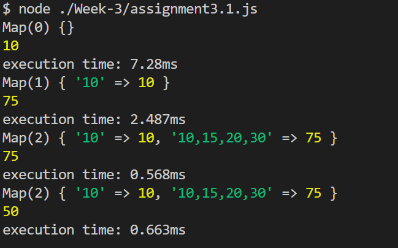

## Pesto-p4 | WEEK3-JS | Exercise 3.1 | Swapnil Akolkar

## Question

Create a memoize function that remembers previous inputs and stores them in cache so that it won’t have to compute the same inputs more than once. The function will take an unspecified number of integer inputs and a reducer method.

## Solution:

### **JavaScript Memoization**

As our systems mature and begin to do more complex calculations, the need for speed grows, and process optimization becomes a need. When we overlook this issue, we end up with applications that take a long time to run and demand a large number of system resources.

**Memoization:** Memoization is a technique for speeding up applications by caching the results of expensive function calls and returning them when the same inputs are used again.

*Let us try to understand this by breaking the definition into small parts:*

**Expensive Function Calls:** Time and memory are the two most important resources in computer applications. As a result, an expensive function call is one that consumes large amounts of these two resources due to extensive calculation during execution.

**Cache:** A cache is just a temporary data store that stores data in order to serve future requests for that data more quickly.
**Importance of Memoization:** When a function is given in input, it performs the necessary computation and saves the result in a cache before returning the value. If the same input is received again in the future, it will not be necessary to repeat the process. It would simply return the cached answer from the memory. This will result in a large reduction in a code’s execution time.

In JavaScript, the concept of memorization is based mostly on two ideas. They are as follows:
- Closures
- Higher-Order Functions

**Closures:** A closure is a function having access to the parent scope, even after the parent function has closed
**Higher-Order Functions:** Higher-order functions are functions that operate on other functions by taking them as arguments or returning them.

*[Understanding Memoization in JS](https://www.geeksforgeeks.org/javascript-memoization/#:~:text=Importance%20of%20Memoization%3A%20When%20a,cached%20answer%20from%20the%20memory.)*
